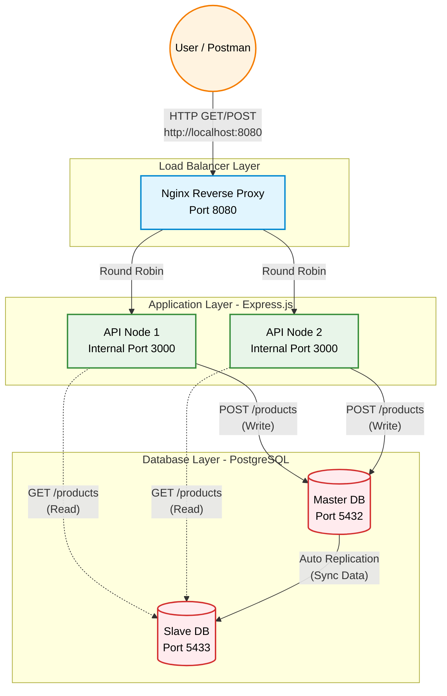

# Scalable System Design


## 1. Project Overview
This project demonstrates a functional, scalable backend infrastructure built from scratch. It features a load-balanced environment with a replicated database architecture, ensuring high availability and fault tolerance.

### Key Technologies
* **Load Balancer:** Nginx
* **Application Layer:** Node.js (Express)
* **Database Layer:** PostgreSQL (Master-Slave Replication)
* **Containerization:** Docker & Docker Compose

---

## 2. System Architecture


---

## 3. Setup Guide (How to run)
Follow these step-by-step instructions to reproduce the environment on your local machine.

### Prerequisites
* [Docker](https://www.docker.com/products/docker-desktop) installed and running.
* Git installed.

### Installation Steps
1. **Clone the repository:**
   ```bash
   git clone https://github.com/MinhHCMUSsv/scalable-system-design.git
   cd scalable-system-design
   ```

2. **Start the infrastructure:**
   Build and spin up the Load Balancer, API nodes, and Database nodes using Docker Compose:
   ```bash
   docker-compose up -d --build
   ```
3. **Verify running containers:**
   Ensure all 5 containers are running successfully:
   ```bash
   docker ps
   ```

### Testing the System
You can test the system using `curl` or Postman. All requests should be sent to the Nginx Load Balancer on port 8080.

#### Test 1: Write to Master (POST)
   ```bash
   curl -X POST http://localhost:8080/products -H "Content-Type: application/json" -d "{\"name\": \"Laptop Dell XPS\", \"price\": 1500}"
   ```
   *Expected output: Success message showing `processed_by: Node_1` or `Node_2`.*

#### Test 2: Read from Slave & Load Balancing (GET)
   Run this command multiple times:
   ```bash
   curl http://localhost:8080/products
   ```
   *Expected output: The `processed_by` field will toggle between `Node_1` and `Node_2`, proving that Nginx Round Robin is working.*

#### Test 3: Fault Tolerance (Chaos Test)
   Stop one of the API nodes manually:
   ```bash
   docker stop scalable-system-design-api_node_1-1
   ```
   Send the GET request again. The system will continue to function, serving data exclusively from the surviving node.

   ---

## 4. Configuration Snippets

### A. Load Balancing (Nginx)
The `nginx.conf` file is configured to proxy requests to an upstream cluster using the default Round Robin algorithm.
```nginx
events { worker_connections 1024; }

http {
    upstream api_cluster {
        server api_node_1:3000;
        server api_node_2:3000;
    }

    server {
        listen 80;

        location / {
            proxy_pass http://api_cluster;
            proxy_set_header Host $host;
            proxy_set_header X-Real-IP $remote_addr;
            proxy_set_header X-Forwarded-For $proxy_add_x_forwarded_for;
        }
    }
}
```

### B. Database Replication (Docker Compose)
Master-Slave replication is configured using Bitnami PostgreSQL environment variables.
```yaml
pg_slave:
    image: bitnami/postgresql:latest
    depends_on:
      - pg_master
    environment:
      - POSTGRESQL_REPLICATION_MODE=slave
      - POSTGRESQL_MASTER_HOST=pg_master
      # ... authentication variables
```

### C. Read/Write Splitting (Application Layer)
In `database.js`, two independent connection pools are maintained to separate traffic.
```javascript
// Master connection for Writes
export const poolMaster = new Pool({ host: process.env.DB_MASTER_HOST, ... });

// Slave connection for Reads
export const poolSlave = new Pool({ host: process.env.DB_SLAVE_HOST, ... });
```

## 5. Video Demonstration

**Demo Video Link:** [https://www.youtube.com/watch?v=FJZbS5HlxRw](https://www.youtube.com/watch?v=FJZbS5HlxRw)

In this video, we demonstrate the following features:
- Initializing the Master-Slave database architecture using Docker Compose.
- Routing write operations (POST) to the Master DB.
- Load balancing read operations (GET) across API instances via Nginx (Round Robin).
- Testing the automated fallback mechanism during simulated API Node failures (Chaos Testing).